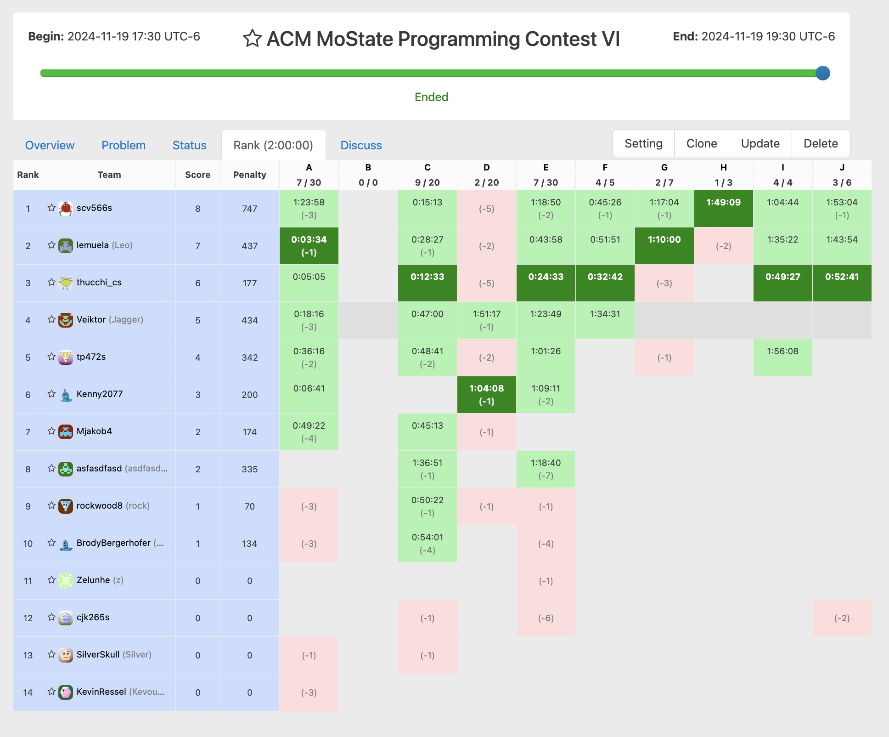

# ACM Programming Contest Fall 2024

Link of Contest: [https://vjudge.net/contest/673519](https://vjudge.net/contest/673519)

**NOTE:** In C++, there's a shortcut to import all the libraries. Of course, it is recommended to only use it in competitions for time management.

```cpp
#include <bits/stdc++.h>
```

| Problem # | Origin           | Title                       |                    |
| --------- | ---------------- | --------------------------- | ------------------ |
| A         | CodeForces 71A   | Way Too Long Words          |                    |
| _B_       | _Kattis_         | _I've Been Everywhere, Man_ | **(extra credit)** |
| C         | CodeForces 118A  | String Task                 |                    |
| D         | CodeForces 158B  | Taxi                        |                    |
| E         | CodeForces 41A   | Translation                 |
| F         | CodeForces 160A  | Twins                       |
| G         | CodeForces 1760C | Advantage                   |
| H         | CodeForces 1335C | Two Teams Composing         |
| I         | CodeForces 1873A | Short Sort                  |
| J         | CodeForces 50A   | Domino Piling               |

## Leaderboard


